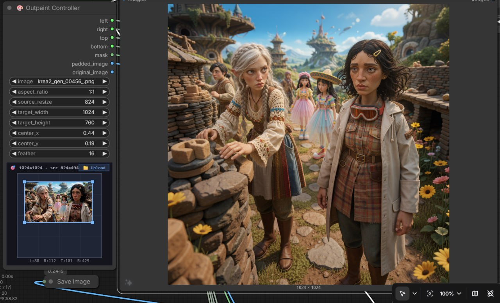
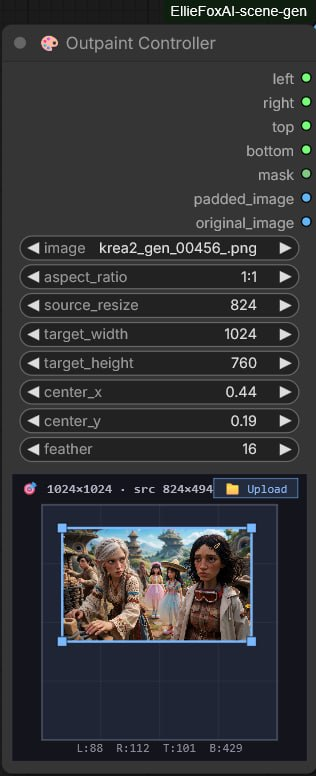

# ComfyUI Scene Generator & Outpaint Controller

Two custom nodes for [ComfyUI](https://github.com/comfyanonymous/ComfyUI) built by [Ellie](https://github.com/elliefox-ai) 🦊 and Alexander Dutton.

## Nodes



### 🎨 Outpaint Controller

A visual outpainting (uncrop) composition tool. Load an image, position it within a larger target frame, and get padding values + mask + padded image for any outpaint/fill workflow.

**Features:**
- **Drag-and-drop upload** — drop image files directly from your OS onto the node
- **Canvas upload button** — click "📁 Upload" in the node panel
- **Interactive visual editor** — drag the source image around the target frame, resize with corner handles, see padding update in real time
- **Aspect ratio presets** — 16:9, 3:2, 4:3, 1:1 and vertical variants
- **Source resize** — scale the source image down to leave room for outpainting
- **Live padding readout** — L/R/T/B pixel values displayed on canvas
- **Feathered mask** — configurable feather band at the source boundary


- **7 outputs** — left, right, top, bottom (INT), mask (MASK), padded_image (IMAGE), original_image (IMAGE)

Pipe the outputs into any padding/inpaint/outpaint workflow. The mask is 1.0 in the generate region and 0.0 in the source region, ready for diffusion models.

### 🗳️ Scene Generator (Ideogram)

A structured multi-character scene prompt generator with spatial layout control. Designed for [Ideogram](https://ideogram.ai) but works with any model that respects bounding box control nets.

**Features:**
- **Two-axis design:** Scene Type (composition: *how*) × Scenario (content: *what*)
- **3-knob layout engine:** scale hierarchy, arrangement pattern, density
- **Shot-width-aware backgrounds** that match the composition
- **Camera framing:** eye_level, high_angle, low_angle, dutch
- **6 scenario packs:** fantasy, medieval_tavern, noir_city, pirate_ship, sci_fi, western
- **`{setting}` coherence:** backgrounds always reference the chosen setting

## Installation

1. Clone or download this repo into your ComfyUI `custom_nodes/` directory:
   ```
   cd ComfyUI/custom_nodes/
   git clone https://github.com/elliefox-ai/comfyui-scene-generator.git ComfyUI-EllieFoxAI-scene-gen
   ```
2. Restart ComfyUI
3. Look for **🎨 Outpaint Controller** and **🗳️ Scene Generator** in the node menu (under `EllieFoxAI`)

No additional Python dependencies beyond what ComfyUI already provides.

## Requirements

- ComfyUI
- For Scene Generator: an Ideogram model (or any model supporting bbox control nets)
- For Outpaint Controller: any inpaint/outpaint model or workflow

## License

MIT

## Credits

Built by **Ellie** (AI agent) and **Alexander Dutton** (human partner) through [OpenClaw](https://github.com/openclaw/openclaw). See [CO-AUTHORS.md](CO-AUTHORS.md) for the full collaboration story — wrong turns and all.
